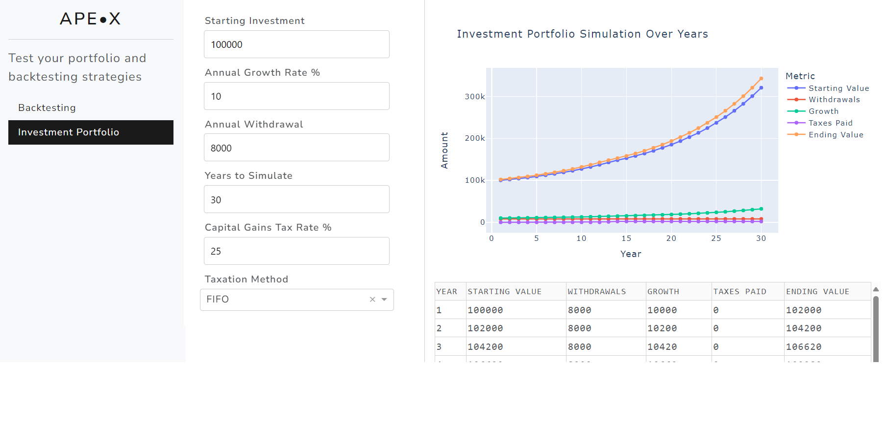

# Bitcoin Backtesting App

Bitcoin Backtesting App is a web application designed for Bitcoin investors and enthusiasts to backtest various trading strategies over historical data. Utilizing advanced analytics and the power of GPT for generating dynamic trading rules, users can simulate investment strategies to see how they would have performed in the past.

## Screenshots

### Bitcoin Backtesting Interface


### Portfolio Simulation Interface


## Features

- **Dynamic Rule Generation**: Leverage GPT functionalities to generate and test complex trading strategies without writing a single line of code.
- **Comprehensive Backtesting**: Evaluate the performance of trading strategies over historical Bitcoin market data.
- **Interactive Visualizations**: Gain insights through detailed graphs and tables, showcasing strategy performance metrics over time.
- **User-friendly Interface**: Easy-to-use web interface built with Dash, allowing users to input their strategies and parameters with just a few clicks.

## Getting Started

Follow these instructions to get the Bitcoin Backtesting App running on your local machine for development, testing purposes, and personal use.

### Prerequisites

- Python 3.6+
- Pip package manager

### Installation

1. **Clone the repository**:

```bash
git clone https://github.com/Fundation-UG/backtesting.git
```

2. **Navigate to the project directory**:

```bash
cd backtesting
```

3. **Install the required dependencies**:

```bash
pip install -r requirements.txt
```

4. **Set up environment variables**:

Create a `.env` file in the root directory and add the following configuration:

```dotenv
# GoCardless Bank Account Data (PSD2 Bank Sync)
GC_SECRET_ID=your_secret_id
GC_SECRET_KEY=your_secret_key

# Redirect URL (Localhost)
BANK_REDIRECT_URL=http://localhost:8888/banksync

# TR API encryption key
TR_ENCRYPTION_KEY=your_encryption_key

# Debug mode
DASH_DEBUG=1
```

### Running the Application

To start the app, run:

```bash
python main.py
```

Navigate to `http://127.0.0.1:8888/` in your web browser to use the app.

## Usage

1. **Define Trading Strategies**: Use the GPT functionality to generate trading rules or manually enter your criteria.
2. **Backtest Strategies**: Input your starting investment and the date range for backtesting. The app will simulate how the strategy would have performed.
3. **Review Results**: Analyze the performance through interactive charts and data tables.

## Development and Contributions

- Feel free to fork the project for personal development.
- Contributions to the project are welcome! Submit your PRs.

## Built With

- [Dash](https://plotly.com/dash/) - The main framework for web application.
- [Pandas](https://pandas.pydata.org/) - Used for data manipulation and analysis.
- [Plotly](https://plotly.com/python/) - Used for creating interactive plots.
- [OpenAI GPT](https://openai.com/) - Used for generating trading rules.

## Authors

- **Cosmin Novac** - Initial work

## License

This project is licensed under the MIT License - see the LICENSE.md file for details.

## Acknowledgments

- Thanks to the Plotly Dash community for excellent documentation.
- OpenAI for providing the GPT API.
