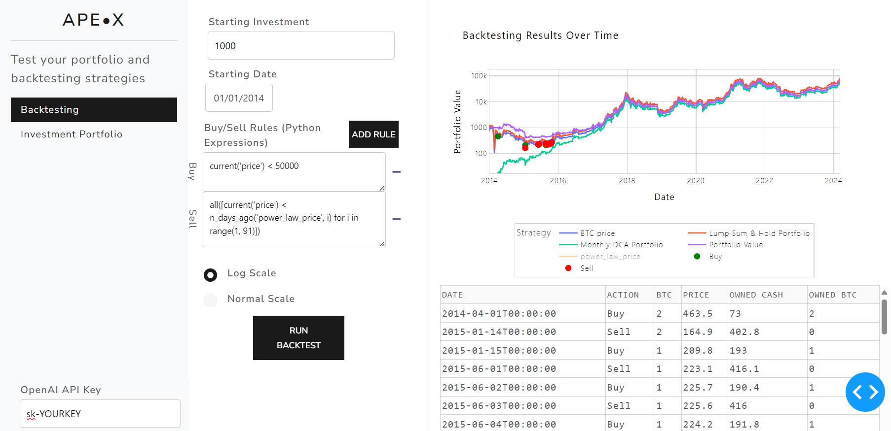

# APE•X — Portfolio & Backtesting Platform

APE•X is a comprehensive web application for investors to analyze portfolios, backtest trading strategies, simulate long-term investment outcomes, sync bank accounts, and understand the true opportunity cost of spending. It integrates with Trade Republic and GoCardless Open Banking, and uses GPT to generate trading rules from natural language.

## Screenshots

### Backtesting


### Investment Simulator


## Features

### Portfolio Analysis
Connect your Trade Republic account and get a full breakdown of your portfolio. View current holdings with real-time values, profit/loss per position, and allocation charts. Compare your portfolio performance against benchmarks like the S&P 500, MSCI World, Nasdaq 100, and more over multiple timeframes (1W, 1M, YTD, 1Y, 3Y, 5Y, MAX). A demo portfolio is available for users who want to explore without connecting a broker.

### Backtesting
Test trading strategies on any asset available via Yahoo Finance — cryptocurrencies, ETFs, indices, stocks, and commodities. Define buy/sell rules using a pill-based rule builder or ask GPT to generate rules from a plain-English description. The backtester evaluates your strategy over historical data and displays an interactive equity curve, trade log, and performance metrics including total return, max drawdown, and Sharpe ratio.

### Investment Simulator
Model long-term portfolio growth with configurable parameters: starting value, annual growth rate, withdrawal strategy (fixed or percentage), tax rate, and simulation horizon. Optionally use real historical S&P 500 returns. The simulator outputs a year-by-year breakdown of portfolio value, growth, withdrawals, taxes paid, and ending value — plus a projection chart.

### Bank Account Sync
Connect bank accounts across 16+ European countries via GoCardless PSD2 Open Banking. Sync transactions, auto-categorise them with AI, create recurring-transaction rules, and monitor expected vs actual cash flows. Supported countries include Germany, Austria, Switzerland, Netherlands, France, UK, Sweden, Spain, Italy, Belgium, Poland, Denmark, Norway, Finland, Ireland, and Portugal.

### Exit Strategy Riskbands
Plan your exit strategy using configurable price bands. Define stop-loss prices and allocation percentages for each band. The simulator runs through all possible price movement scenarios and shows how much capital you'd extract under each path. Useful for systematically de-risking a concentrated position.

### The Real Cost
Visualise the opportunity cost of any purchase. Enter the cost of an item (or pick from presets like a car, vacation, or iPhone) and see what that money would have grown to if invested instead. Configurable growth rates and time horizons put everyday spending into long-term perspective.

## Getting Started

### Prerequisites

- Python 3.11+
- Pip package manager

### Installation

1. **Clone the repository**:

```bash
git clone https://github.com/FundationOne/backtesting.git
```

2. **Navigate to the project directory**:

```bash
cd backtesting
```

3. **Install the required dependencies**:

```bash
pip install -r requirements.txt
```

4. **Set up environment variables**:

Create a `.env` file in the root directory:

```dotenv
# GoCardless Bank Account Data (PSD2 Bank Sync)
# Get credentials at https://bankaccountdata.gocardless.com
GC_SECRET_ID=your_secret_id
GC_SECRET_KEY=your_secret_key

# Redirect URL after bank authentication
# Local: http://localhost:8888/banksync
# Production: https://your-domain.com/banksync
BANK_REDIRECT_URL=http://localhost:8888/banksync

# TR API encryption key (for portfolio sync credentials)
TR_ENCRYPTION_KEY=your_encryption_key

# Debug mode (1 = enabled, 0 = disabled)
DASH_DEBUG=1
```

> **Note:** GoCardless and TR credentials are optional. The app runs without them — bank sync and portfolio sync features will simply be unavailable.

### Running the Application

```bash
python main.py
```

Open `http://127.0.0.1:8888/` in your browser.

### Production Deployment

The app is configured for Azure App Service with gunicorn:

```bash
gunicorn --bind=0.0.0.0:8000 --timeout 600 --preload --workers 2 main:server
```

See [docs/DEPLOYMENT.md](docs/DEPLOYMENT.md) for full deployment instructions.

## Built With

- [Dash](https://plotly.com/dash/) — Web application framework
- [Plotly](https://plotly.com/python/) — Interactive charts and visualisations
- [Pandas](https://pandas.pydata.org/) — Data manipulation and analysis
- [yfinance](https://github.com/ranaroussi/yfinance) — Yahoo Finance market data
- [OpenAI GPT](https://openai.com/) — Natural language trading rule generation
- [GoCardless](https://bankaccountdata.gocardless.com/) — PSD2 Open Banking API
- [pytr](https://github.com/pytr-org/pytr) — Trade Republic API

## Authors

- **Cosmin Novac** — Initial work

## License

This project is licensed under the MIT License — see the LICENSE.md file for details.
